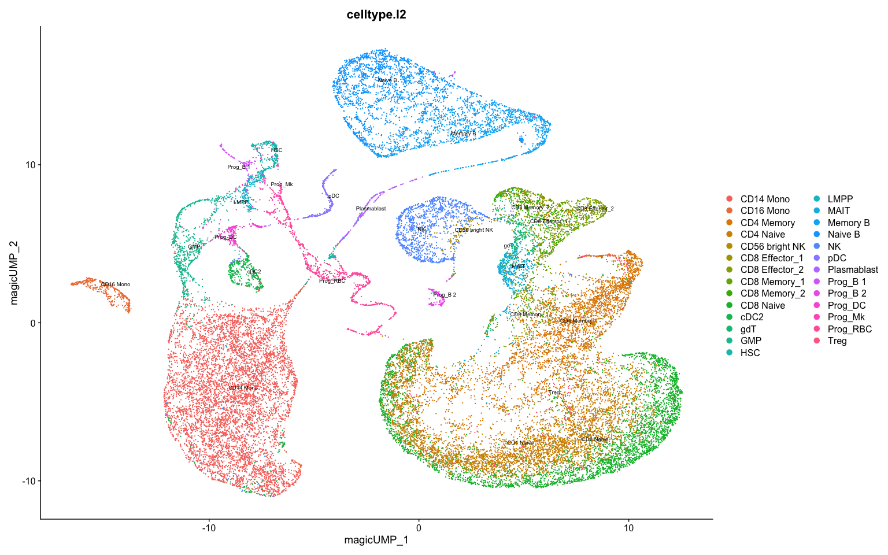

Run MAGIC imputation using Seurat
================
Xizeng ‘Ethan’ Mao
3/9/2021

-   [Run MAGIC on Seurat](#run-magic-on-seurat)

## Run MAGIC on Seurat

Demonstrate usage of RunMAGIC with Seurat object

Prerequisites to install:

-   [Seurat](https://satijalab.org/seurat/install)
-   [Rmagic](https://github.com/KrishnaswamyLab/MAGIC/tree/master/Rmagic)
-   [SeuratWrappers](https://github.com/satijalab/seurat-wrappers)

``` r
library(Seurat)
library(Rmagic)
library(SeuratWrappers)
library(SeuratData)
```

``` r
SeuratData::InstallData("bmcite")
bm <- LoadData(ds = "bmcite")

bm <- RunMAGIC(bm)
# Now default assay of bm is MAGIC with orignal counts and imputed data slot

# Default selection.method='vst' use counts instead of data slot in assay
bm <- FindVariableFeatures(bm, selection.method = "disp")
bm <- ScaleData(bm)

# Save PCA from magic data to magic.pca, avoiding overwriting default pca
bm <- RunPCA(bm, reduction.name = "magic.pca", reduction.key = "magicPCA_")
# Save UMAP from magic.pca to magic.umap, avoiding overwriting default umap
bm <- RunUMAP(bm, dims = 1:20, reduction = "magic.pca", reduction.name = "magic.umap", reduction.key = "magicUMP_")
# DimPlot using MAGIC-based UMAP reduction
DimPlot(bm, reduction = "magic.umap", group.by = "celltype.l2", label = TRUE, repel = TRUE, label.size = 2.5)
```

<!-- -->
